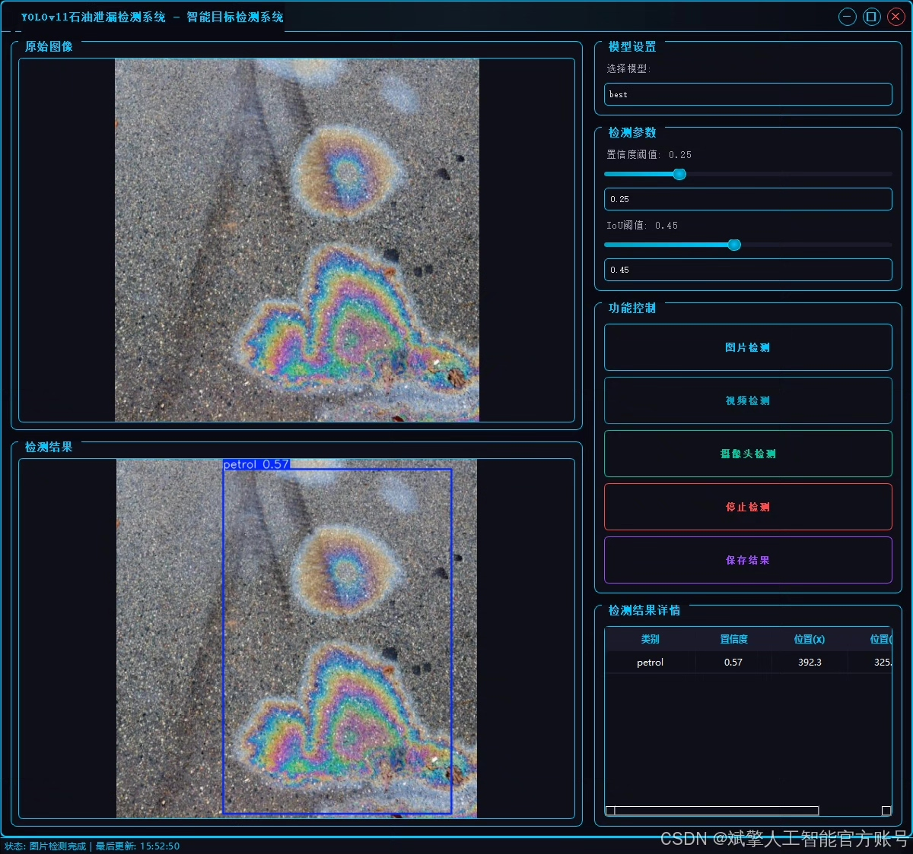
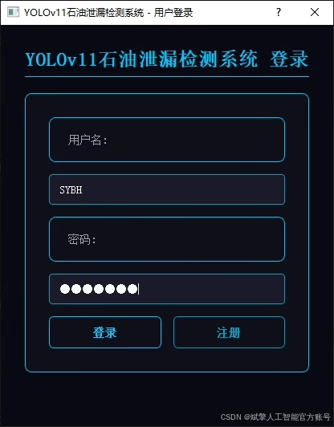
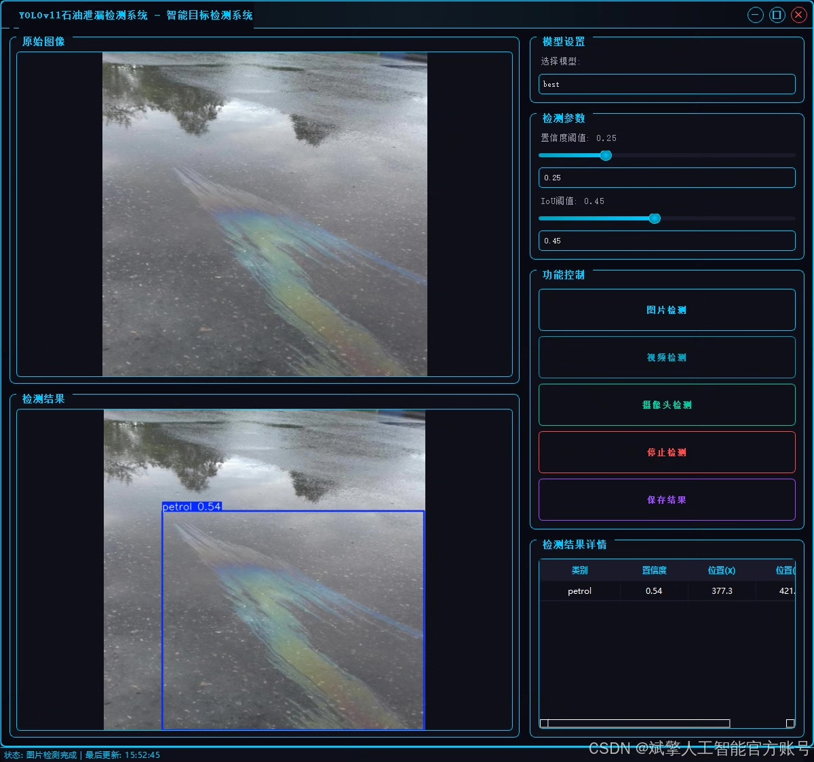
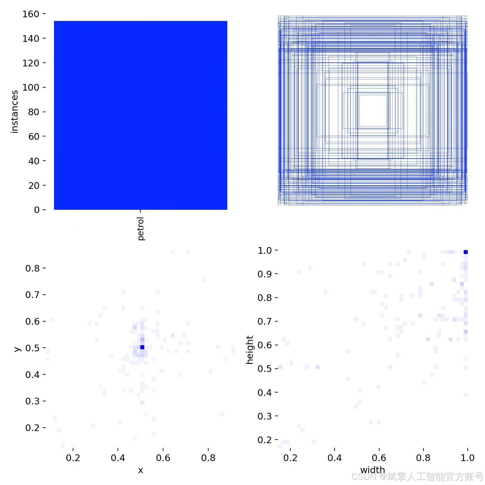
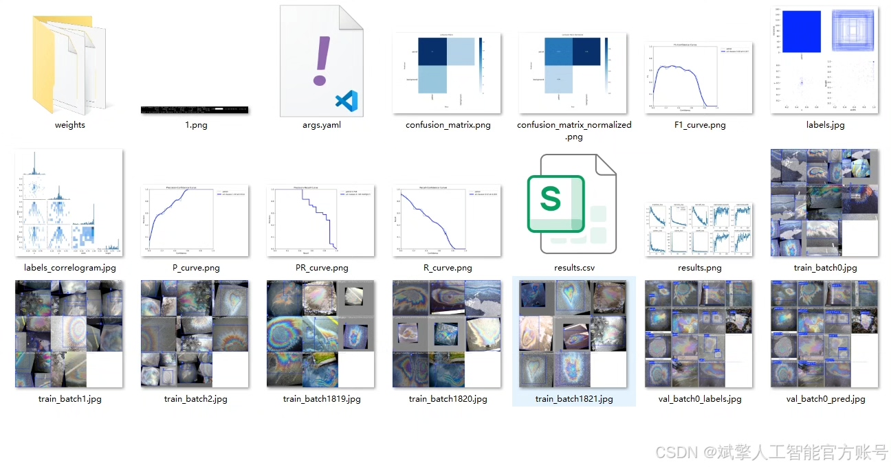
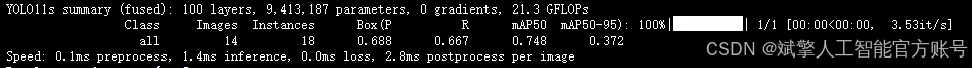
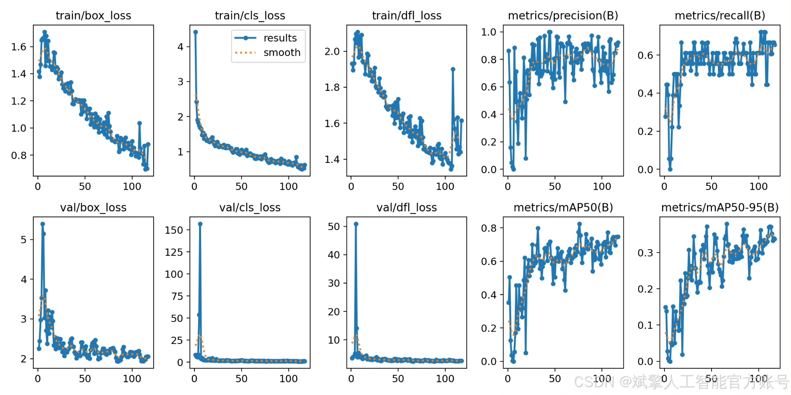
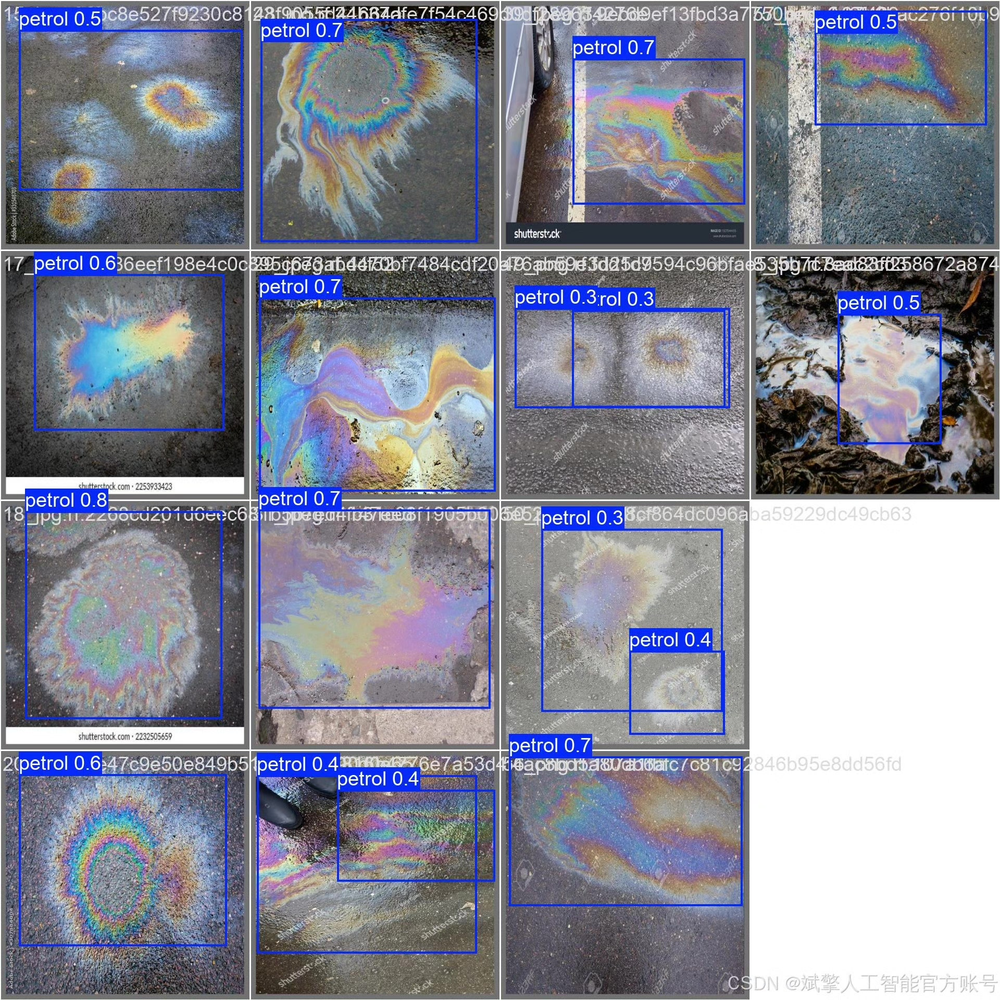

# YOLOv11 oil spill detection system

## Body

YOLOv11 Oil Spill Detection System Based on Deep Learning YOLOv11: A comprehensive oil spill detection system (YOLOv11+YOLO dataset + UI interface + login registration interface + Python project source code + model)

✅ User Login and Registration: Supports password verification and security validation.

✅ Three Detection Modes: Based on the YOLOv11 model, supports image, video, and real-time camera detection, with precise recognition of targets.

✅ Dual-Screen Comparison: Displays the original scene and detection results on the same screen.

✅ Data Visualization: Real-time table displays the category, confidence, and coordinates of detected targets.

✅ Intelligent Parameter Tuning: Offers a confidence slide bar to dynamically optimize detection accuracy, adapting to different scene requirements.

✅ Sci-Fi Interactive Interface: Dark theme paired with dynamic light effects, reducing visual fatigue and enhancing operational experience.

## Images

## Payment

Here is a pay link on Stripe ( https://buy.stripe.com/3cs8yP7sY87d0vu9AB ). Please contact me lonlonago@foxmail.com after funding $89, and I will send you a complete data files , thank you!

